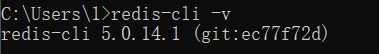

# 一.简介

Redis作为常用开源非关系型数据库，是开发中常用的数据库之一。

官网：https://redis.io/（无window版）

github：https://github.com/tporadowski/redis/releases（window版）

# 二.重要文件

redis.windows.conf

redis.windows-service.conf

redis-cli.exe:启动redis命令行

redis-servre.ext:启动redis服务

# 三.环境变量配置

通过配置环境的方式，让我们可以通过命令行的方式操作redis。

（1）复制redis的路径

（2）添加到path中

四.验证

（1）打开cmd窗口输入：

redis-cli -v(显示版本号)

（2）启动Redis服务

redis-server（窗口不能关闭，否则服务就会停止）

（3）连接redis

redis-cli

（4）关闭redis

redis-cli shutdown