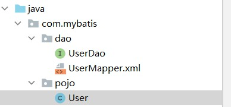
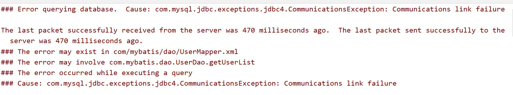
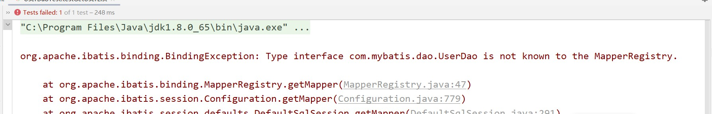

# MyBatis搭建

## 1、环境

1、maven

2、mysql

## 2、搭建（1）

(一)**创建mybatis-config.xml**

包含了对 MyBatis系统的核心设置，包括获取数据库连接实例的数据源（DataSource）以及决定事务作用域和控制方式的事务管理器（TransactionManager）

```xml
<?xml version="1.0" encoding="UTF-8" ?>
<!DOCTYPE configuration
        PUBLIC "-//mybatis.org//DTD Config 3.0//EN"
        "http://mybatis.org/dtd/mybatis-3-config.dtd">
<!--核心配置文件-->
<configuration>
    <environments default="development">
        <environment id="development">
            <transactionManager type="JDBC"/>
            <dataSource type="POOLED">
                <property name="driver" value="com.mysql.jdbc.Driver"/>
                <property name="url" value="jdbc:mysql://localhost:3306/mybatis?useSSL=false&amp;useUnicode=true&amp;characterEncoding=utf-8"/>
                <property name="username" value="root"/>
                <property name="password" value="123456"/>
            </dataSource>
        </environment>
    </environments>

    <mappers>
        <mapper resource="com/mybatis/dao/UserMapper.xml"/>
    </mappers>
</configuration>
```

**(二）加载配置文件**

**使用了建造者模式**

以一个 SqlSessionFactory的实例为核心的。SqlSessionFactory 的实例可以通过 SqlSessionFactoryBuilder       获得。而 SqlSessionFactoryBuilder 则可以从 XML 配置文件或一个预先配置的Configuration 实例来构建出 SqlSessionFactory 实例。

```java
public class MyBatisUtil {
    private static SqlSessionFactory sqlSessionFactory;
    static{
        try {
            String resource = "mybatis-config.xml";
          //加载配置文件
            InputStream inputStream = Resources.getResourceAsStream(resource);
          //使用SqlSessionFactoryBuilder()调用build方法，返回SqlSessionFactory
            sqlSessionFactory = new SqlSessionFactoryBuilder().build(inputStream);
        } catch (IOException e) {
            e.printStackTrace();
        }
    }

    public static SqlSession getSqlSession(){
      //调用openSession()获取SqlSession
        return sqlSessionFactory.openSession();
    }
}
```

(三)**实现**




创建一个pojo

创建一个dao

```java
public interface UserDao {
    public List<User> getUserList();
}

```

不再使用impl，改成maper实现

其中Usermapper.xml

```xml
<?xml version="1.0" encoding="UTF8" ?>
<!DOCTYPE mapper
        PUBLIC "-//mybatis.org//DTD Mapper 3.0//EN"
        "http://mybatis.org/dtd/mybatis-3-mapper.dtd">
<!--绑定一个对应的Dao;命名空间-->
<mapper namespace="com.mybatis.dao.UserDao">
<!--    查询语句
           id：对应方法名
           resultType:返回类型-->
    <select id="getUserList" resultType="com.mybatis.pojo.User">
        select * from mybatis.user;
    </select>
</mapper>

```

## 3、测试

```java
public class UserDaoTest {
    @Test
    public void testGetUserList(){
//        获得sqlSession对象
        SqlSession sqlSession = MyBatisUtil.getSqlSession();
        //方法一：getMapper()
        //执行sql
        UserDao mapper = sqlSession.getMapper(UserDao.class);

        //方式二：
        //List<Object> objects = sqlSession.selectList("com.mybatis.dao.UserDao.getUserList");
        List<User> userList = mapper.getUserList();
        for (User user : userList) {
            System.out.println(user);
        }
        sqlSession.close();
    }
}
```

## 4、所遇问题

（1）maven约束大于配置，不能将xml加载到target目录下解决方法：在pom.xml中配置以下代码

```xml
 <build>
        <resources>
            <resource>
                <directory>src/main/resource</directory>
                <includes>
                    <include>**/*.properties</include>
                    <include>**/*.xml</include>
                </includes>
                <filtering>true</filtering>
            </resource>
            <resource>
                <directory>src/main/java</directory>
                <includes>
                    <include>**/*.properties</include>
                    <include>**/*.xml</include>
                </includes>
                <filtering>true</filtering>
            </resource>
        </resources>
    </build>
```

（2）url连接问题




原因：useSSL=ture需要改成false

**1. MySQL在高版本需要指明是否进行SSL连接**

(保障Internet数据传输安全利用数据加密)需要在url后面添加useSSL=true或者false不然在运行时控制台会出现红色警告。

useSSL=true 需要连接

useSSL=false 不需要连接

```java
<property name="url" value="jdbc:mysql://localhost:3306/mybatis?useSSL=ture&amp;useUnicode=true&amp;characterEncoding=utf-8"/>
```

（3）mapper配置

如果不在mybatis-config.xml配置文件中，配置<mappers></mappers>j就会报错

由于UserDao接口中的方法是用UserMapper.xml实现的

配置mappers是方便SqlSessionFactoryBuild读取调用




```xml
	<mappers>
        <mapper resource="com/mybatis/dao/UserMapper.xml"/>
    </mappers>
```

