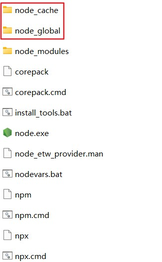
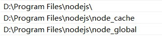
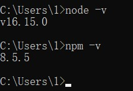
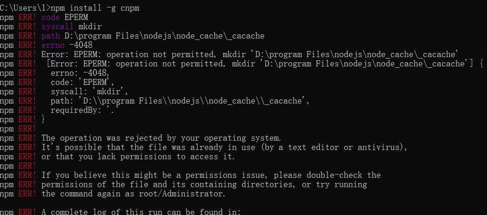
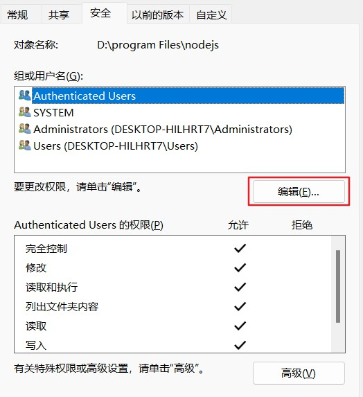
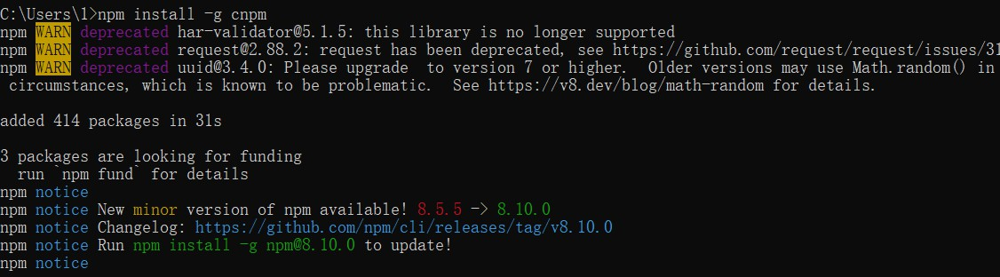
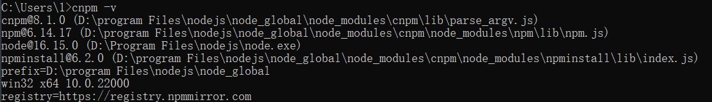

# Node.js安装

## (1)下载地址：

​         https://nodejs.org/zh-cn/

​         如果下载压缩包需要自己配置path

## (2)解压后需要在解压文件中创建node_cache,node_global两个文件夹

## (3)配置path

## (4)cmd验证版本

## (5)修改配置文件node_cache,node_global

npm config set prefix "D:\program Files\nodejs\node_global"

npm config set cache "D:\program Files\nodejs\node_cache"

## (6)配置淘宝镜像

npm config set registry https://registry.npm.taobao.org

## (7)配置国内cnpm命令

npm install -g cnpm

出现以上错误是用户没有修改文件的权限，我们通过修改操作权限解决，如下：

再次执行：npm install -g cnpm

/assets/nodeSuccess.jpg)

配置成功！！