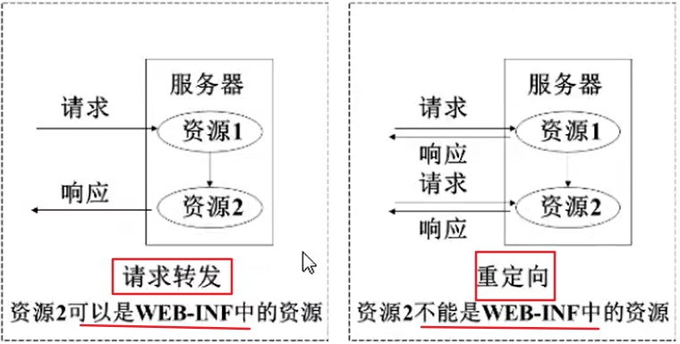
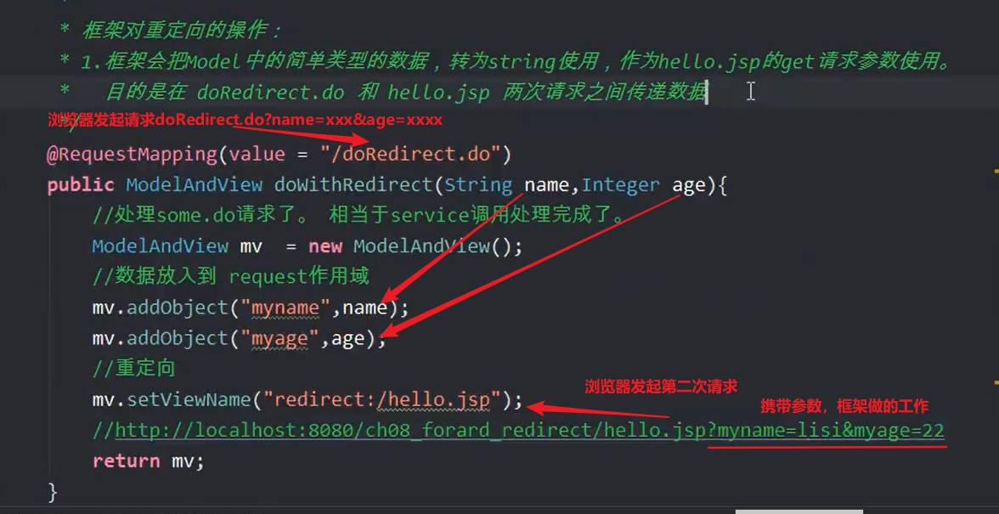
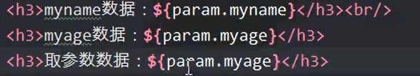
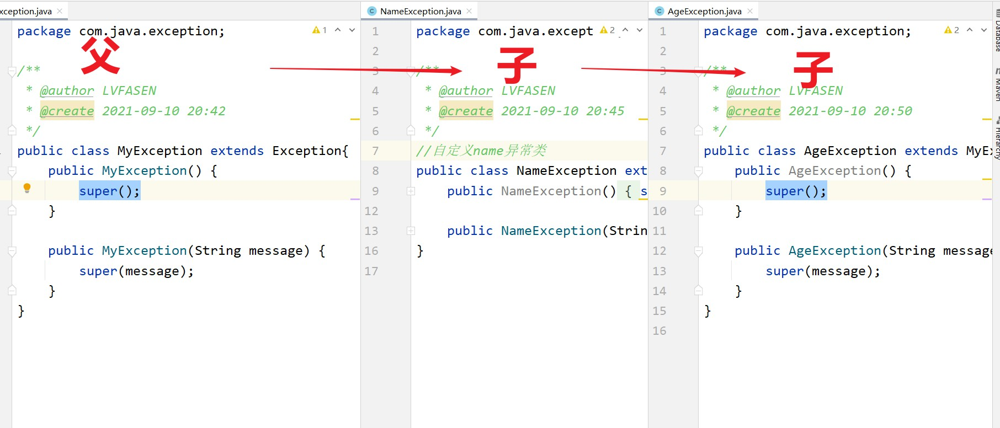

#请求转发和重定向




springmvc框架把原来Servlet中的请求转发和重定向操作进行了封装。现在可以使用简单的方式实现转发和重定向。

forword：表示转发,实现request.getRequestDispatcher("xx.jsp").forword(req,resp);

redirect：表示重定向，实现response.sendRedirect("XXX.JSP")

forword和redirect都是关键字，有一个共同的特点：就是不和视图解析器一同使用，也就是自动忽略视图解析器

处理器方法返回ModelAndView时，实现转发forword

语法：setViewName("forword:视图文件完整路径")

特点:忽略视图解析器

setViewName("show");

setViewName("forword:/WEB-INF/view/show");

两个作用都是转发，但第一个依靠视图解析器，如果文件所在的目录不在视图解析器的范围那么使用forword就可以完成转发

处理器方法返回ModelAndView，实现重定向redirect

语法：setViewName("redirect:视图完整路径")

redirect特点：和forword一样，忽略视图解析器




使用param域来获取重定向访问路径后的参数




#异常处理

springmvc框架采用的是统一,全局的异常处理。

把controller中的所有异常处理都集中到一个地方。采用的是aop的思想。把业务逻辑和异常处理代码分开。解耦合。

## （1）使用两个注解：

@ExceptiontionHandler

@ControllerAdvice

## （2）步骤

1.新建maven web项目

2.加入依赖

3.新建一个自定义异常类MyUserException，在定义它的子类NameException,AgeException

4.在controller抛出NameException，AgeException

5.创建一个普通类，作用全局异常处理类

​      1》在类的上面加入@ControllerAdvice

​	  2》在类中定义方法，方法的上面加入@ExceptionHandler

6.创建异常的视图页面

7.创建springmvc的配置文件

​	   1》组件扫面器，扫描@controller

​	   2》扫描@ControllerAdvice所在包名

​	   3》注解驱动




## （3）controller处理器

```java

    @RequestMapping("some.do")
    public ModelAndView jump( String name, int age) throws MyException {
        ModelAndView mv = new ModelAndView();
        if(!name.equals("zhangsan")){
            throw new NameException("名字不正确！！！");
        }
        if(age > 80){
            throw new AgeException("年龄不合适!!!");
        }
        int i = 2/0;
        mv.addObject("name",name);
        mv.addObject("age",age);
        mv.setViewName("some");
        return mv;
    }
```

## （4）全局异常处理器

```java
/*
        * @ControllerAdvice:控制器增强（也就是说给控制器类增加功能---异常处理功能）
        位置：在类的上面
        特点：必须让框架知道这个注解所在的包名，需要在springmvc配置文件声明组件扫描器。
        定义方法，处理异常
        处理异常的方法和控制器方法的定义一样，可以有多个参数，可以有ModelAndView
        String void 对象类型的返回值
        形参：Exception，表示Controller中抛出的异常对象。
        通过形参可以获取发生的异常信息
        * */
@ControllerAdvice
public class GlobalException {

    /*
    * @ExceptionHandler(要处理异常类型的.class)：表示异常的类型，当发生此类型异常时由此方法处理
    * */
    @ExceptionHandler(NameException.class)
    public ModelAndView jump(Exception e){

        /*
        * 异常发生处理逻辑：
        1.需要把异常记录下来，记录到数据库，日志文件。
        记录日志发生的时间，哪个方法发生的，异常错误内容
        2.发送通知，把异常的信息通过邮件，短信，微信发送给相关人员
        3.给用户友好的提示
        * */
        ModelAndView mv = new ModelAndView();
        mv.addObject("msg","姓名只能是张三");
        mv.addObject("exception", e);
        mv.setViewName("nameError");
        return mv;
    }

    @ExceptionHandler(AgeException.class)
    public ModelAndView jump1(Exception e){
        ModelAndView mv = new ModelAndView();
        mv.addObject("msg","年龄不能超过80");
        mv.addObject("exception", e);
        mv.setViewName("ageError");
        return mv;
    }

    //处理其他异常
    @ExceptionHandler
    public ModelAndView otherException(Exception e){
        ModelAndView mv = new ModelAndView();
        mv.addObject("ms","出现异常");
        mv.addObject("exception",e);
        mv.setViewName("defaultError");
        return mv;
    }
}

```


